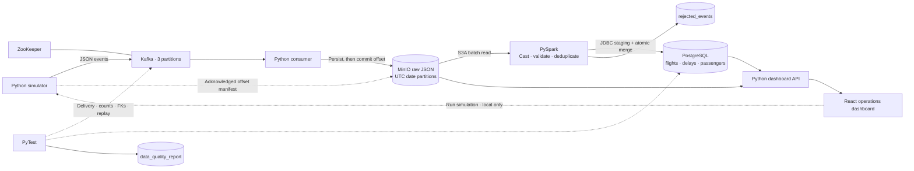

# Airline Ops Data Platform

[](https://github.com/varun566/airline-ops-data-platform/actions/workflows/ci.yml)

A containerized airline operations pipeline that streams simulated delays, gate
changes, departures, and passenger check-ins through Kafka, archives raw JSON in
MinIO, and uses PySpark to load a constrained PostgreSQL data model. A complete
demo includes intentional duplicate events, shuffled arrival order, and real
end-to-end PyTest assertions recorded in the database.

**Stack:** Python 3.11 · Kafka + ZooKeeper (Confluent 7.9.9) · MinIO · PySpark 3.5.7 ·
PostgreSQL 17 · Docker Compose · PyTest · React · TypeScript · Tailwind CSS



## Start everything

Install Docker with the Compose plugin, start the Docker engine, and allocate at
least **6 GB of Docker memory** (8 GB recommended). The first build downloads
Spark, Java drivers, and service images; allow several minutes and around 5 GB of
free disk space. No host Python, Java, or Azure account is required.

```bash
git clone https://github.com/varun566/airline-ops-data-platform.git
cd airline-ops-data-platform
docker compose up --build -d
```

That one command starts infrastructure, creates the topic/bucket/schema, runs the
consumer, publishes a bounded sample, transforms it, and runs the integration
suite, including a second Spark load to verify idempotence.

```bash
docker compose logs -f demo
docker compose ps -a
```

A successful `demo` container exits with code `0` and prints `Demo passed`.
`bootstrap` also exits successfully; the broker, database, object store, and
consumer, dashboard API, and frontend keep running. A failed assertion makes the demo exit nonzero.

| Result from each default demo | Expected |
| --- | ---: |
| Kafka records acknowledged / raw objects landed | 32 / 32 |
| Unique accepted events / duplicate events / rejects | 28 / 4 / 0 |
| Flights / delay observations / passenger bookings | 4 / 4 / 12 |

Generate another independent demo with `docker compose run --rm demo`. Existing
rows remain, and all verification counts are scoped to the new run.

## AeroStream dashboard

**[Open the public recruiter demo](https://aerostream-airline-ops.venkatanagulapalli00.chatgpt.site)** · No setup or sign-in required.
The hosted demo uses recorded synthetic pipeline results.

Open **[AeroStream locally](http://localhost:8088)** after Compose starts.

- **Overview:** route map, event counts, and a searchable flight board.
- **Flight operations:** open a flight to inspect its state, event timeline, original JSON, and raw object key.
- **Pipeline runs:** compare simulations and reconcile raw, unique, duplicate, and rejected counts.
- **Data quality:** expand actual PyTest results persisted in PostgreSQL.
- **Architecture:** explore each pipeline stage, the relational model, and a recruiter presentation script.

**Run simulation** starts a real bounded pipeline run and its integration tests.
The dashboard polls every 12 seconds; selecting **Latest run** follows the new result.
Only one dashboard-triggered simulation runs at a time.

The public portfolio build serves a **recorded snapshot of synthetic data**.
It is labeled as a snapshot and has a project walkthrough in place of the local
simulation action. It does not connect to your laptop or expose PostgreSQL,
Kafka, MinIO, or local credentials. If the local API is unavailable, the dashboard
clearly labels its fallback snapshot.

[Recruiter walkthrough and resume bullets](docs/recruiter-demo.md) ·
[Frontend development and snapshot export](frontend/README.md)

## Inspect the results

Open the [MinIO console](http://localhost:9001), sign in as `airline` with password
`airline-local-only`, and browse the private `airline-raw` bucket. PostgreSQL is
available at `localhost:5433`, database/user `airline`, with the same local demo
password. All published service ports bind to loopback.

```bash
docker compose exec postgres psql -U airline -d airline
```

```sql
SELECT flight_number, flight_date, origin, dest, status, gate,
       scheduled_dep, actual_dep
FROM flights ORDER BY scheduled_dep;

SELECT run_id, status, producer_count, raw_count, valid_count,
       duplicate_count, rejected_count
FROM pipeline_runs ORDER BY created_at DESC;

SELECT validation_id, bool_and(passed) AS all_passed, count(*) AS tests
FROM data_quality_report GROUP BY validation_id ORDER BY validation_id;

SELECT test_name, details FROM data_quality_report WHERE NOT passed;
```

## Run each stage independently

```bash
# Produce one run with a chosen date, intentional duplicates, and shuffled arrival.
docker compose run --rm producer python -m airline_ops.producer --date 2026-09-12 --shuffle

# Transform all completed producer manifests not yet successfully loaded.
docker compose run --rm transform

# Reprocess a specific run; use its UUID from producer output or pipeline_runs.
docker compose run --rm transform python -m airline_ops.transform --run-id <RUN_UUID>

# Stream successive bounded runs until Ctrl-C; transform completed runs separately.
docker compose run --rm producer

# Replay every manifest, including already completed runs.
docker compose run --rm transform python -m airline_ops.transform --replay
```

The consumer runs continuously. Transformation is deliberately **batch based**;
continuous production alone does not schedule Spark. Each manifest is written
only after all Kafka deliveries are acknowledged. Incomplete producer runs remain
in raw storage for investigation and are not silently treated as complete batches.

## Testing

```bash
# Python behavior, failure handling, and actual local Spark transformations.
docker compose run --rm --no-deps tests pytest -q tests/unit

# Validate the most recently transformed run against live services.
docker compose run --rm --no-deps -e RUN_INTEGRATION=1 tests pytest -q tests/integration

# Or validate a specific run.
docker compose run --rm --no-deps -e TEST_RUN_ID=<RUN_UUID> tests pytest -q tests/integration

docker compose run --rm --no-deps tests ruff check .
```

Integration tests independently read the acknowledged Kafka offsets and compare
their counts and payload bytes to the consumer's MinIO objects; check scoped row counts, orphan records,
database-enforced foreign keys and negative-delay rejection, date-level
uniqueness, event accounting, latest state, and unchanged results after replay.
An injected invalid child row also verifies that the complete merge rolls back.
The PyTest hook records actual pass/fail outcomes and failure details using a new
`validation_id` per invocation. Unit tests also simulate a failed object write and
a crash after landing but before offset commit.

[GitHub Actions](.github/workflows/ci.yml) builds and tests the entire stack on a
fresh runner and uploads container logs plus the quality report as artifacts.
`requirements.lock` pins the resolved Python environment used by the Docker build.

## Configuration and operations

Copy `.env.example` to `.env` to change local passwords, host ports, or Spark
driver memory before first startup. Named volumes retain data across restarts.

```bash
docker compose down       # Stop services; keep all data.
docker compose up -d      # Restart services.
```

`docker compose down -v` **deletes this project's Kafka, MinIO, PostgreSQL, and
ZooKeeper data**. Use it only for an intentional clean reset. Changing a password
in `.env` does not update credentials already stored in a PostgreSQL volume.

- [Full schema, event contract, keys, and replay semantics](docs/schema.md)
- [Troubleshooting: consumer lag, connections, Spark memory, recovery](docs/troubleshooting.md)
- [Example event](examples/flight_delay.json)

This is a local portfolio deployment: one Kafka broker, replication factor one,
plaintext internal traffic, synthetic booking IDs, and one JSON object per Kafka
record. MinIO substitutes for ADLS; Azure provisioning and `abfss://` authentication
are not implemented. At larger volumes, compact raw objects into Parquet, schedule
incremental Spark batches, introduce a schema registry, and configure managed
secrets, TLS, observability, and replicated services. ZooKeeper is included to
match the project specification; a new production Kafka deployment should evaluate
KRaft using the [Confluent configuration reference](https://docs.confluent.io/platform/7.9/installation/docker/config-reference.html).

The implementation uses the documented [Spark JDBC writer](https://spark.apache.org/docs/3.5.7/sql-data-sources-jdbc.html)
and [Hadoop S3A connector](https://hadoop.apache.org/docs/r3.3.4/hadoop-aws/tools/hadoop-aws/index.html).
