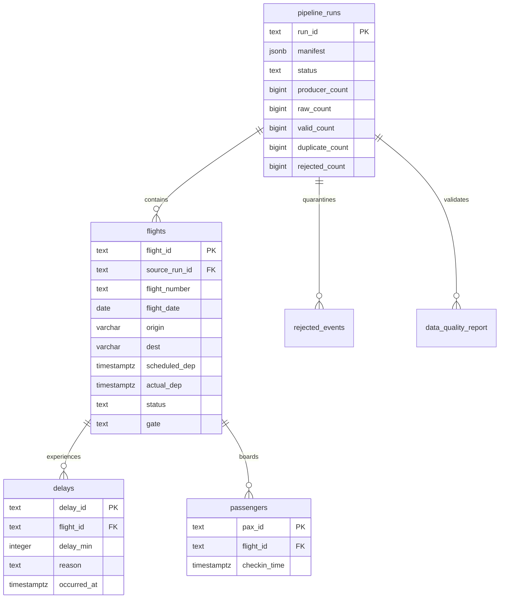

# Data model and event contract

The executable database contract is [`sql/001_schema.sql`](../sql/001_schema.sql).
All timestamps have an explicit UTC offset. PostgreSQL stores `TIMESTAMPTZ`; Spark
runs with `spark.sql.session.timeZone=UTC`. The flight's service date is the UTC
date of scheduled departure, independent of the raw ingestion partition date.

## Event envelope

Each Kafka value is a JSON object using schema version `1`:

| Field | Type | Rule |
| --- | --- | --- |
| `schema_version` | integer | Must be `1` |
| `run_id` | UUID string | Identifies a bounded simulator run and its manifest |
| `event_id` | string | Stable producer event identity, required, max 128 characters |
| `event_type` | string | `flight_scheduled`, `flight_delay`, `gate_change`, `passenger_checkin`, `flight_departed` |
| `flight_id` | string | Unique flight instance, required, max 128 characters |
| `flight_number` | string | Display flight number, required, max 128 characters |
| `timestamp` | ISO 8601 timestamp | Event time; timezone required |
| `origin`, `dest` | string | Distinct three-letter uppercase airport codes |
| `scheduled_dep` | ISO 8601 timestamp | Timezone required; identical across one flight's events |
| `actual_dep` | timestamp or null | Required for departures; equals departure event time |
| `delay_min` | integer, numeric string, or null | Required for delays; whole number in `0..1440` |
| `reason` | string or null | Missing delay reasons become `unspecified` |
| `gate` | string or null | Required for gate changes; latest non-null gate is retained |
| `pax_id` | string or null | Required for check-ins, max 200 characters; flight-specific booking ID |

Other fields are ignored. Empty strings are normalized to null. Unknown types,
bad casts, timezone-free timestamps, invalid routes, missing required fields,
bookings assigned to multiple flights, and missing/conflicting schedule parents
go to `rejected_events`. A manifest defines a complete simulation batch: a flight's
schedule and dependent events must occur in that same run. Arbitrary external
Kafka records are still archived, but need a manifest before batch transformation.

Raw storage wraps the unchanged UTF-8 JSON string in an envelope containing
`payload`, `raw_key`, `topic`, `partition`, `offset`, `kafka_timestamp_ms`, and
`ingested_at`. Invalid UTF-8 is retained as `payload_base64`, with a null payload.
Kafka tombstones are archived with a null payload as well.

```text
airline-raw/
  raw/date=2026-09-12/topic=airline-events/partition=0/offset=00000000000000000012.json
  manifests/<run_id>.json
```

The partition date comes from the stable Kafka record timestamp, so replaying
around midnight uses the same object key. Event time drives relational state.

## Relational schema



| Table | Columns and enforced rules |
| --- | --- |
| `pipeline_runs` | `run_id TEXT PK`; `created_at TIMESTAMPTZ NOT NULL DEFAULT now()`; nullable `transformed_at TIMESTAMPTZ`; nonnegative `producer_count`, `raw_count`, `valid_count`, `rejected_count`, `duplicate_count BIGINT NOT NULL`; `status TEXT NOT NULL` in pending/completed/failed; nullable `error TEXT`; `manifest JSONB NOT NULL` |
| `flights` | `flight_id TEXT PK`; `source_run_id TEXT NOT NULL FK → pipeline_runs`; `flight_number TEXT NOT NULL`; `flight_date DATE NOT NULL`; `origin`, `dest VARCHAR(3) NOT NULL` with airport-code and different-airport checks; `scheduled_dep TIMESTAMPTZ NOT NULL`; nullable `actual_dep TIMESTAMPTZ`; `status TEXT NOT NULL` in scheduled/delayed/departed; nullable `gate TEXT`; `last_event_at TIMESTAMPTZ NOT NULL`; `last_event_id TEXT NOT NULL`. Unique `(source_run_id, flight_number, flight_date)`. Flight date equals UTC scheduled date. Actual departure exists iff status is departed. |
| `delays` | `delay_id TEXT PK` (SHA-256 of flight ID and event timestamp); `flight_id TEXT NOT NULL FK → flights`; `delay_min INTEGER NOT NULL` in 0..1440; `reason TEXT NOT NULL`; `occurred_at TIMESTAMPTZ NOT NULL`. Unique `(flight_id, occurred_at)`. Each row is a delay observation, not an additive delay increment. |
| `passengers` | `pax_id TEXT PK`; `flight_id TEXT NOT NULL FK → flights`; `checkin_time TIMESTAMPTZ NOT NULL`. Earliest valid check-in wins. |
| `rejected_events` | `rejection_id TEXT PK` (SHA-256 of run ID and raw key); `run_id TEXT NOT NULL FK → pipeline_runs`; `raw_key`, `reason TEXT NOT NULL`; nullable `payload TEXT`; `rejected_at TIMESTAMPTZ NOT NULL DEFAULT now()`. Unique `(run_id, raw_key)`. |
| `data_quality_report` | `report_id BIGINT GENERATED ALWAYS AS IDENTITY PK`; `validation_id UUID NOT NULL`; `run_id TEXT NOT NULL FK → pipeline_runs`; `test_name TEXT NOT NULL`; `passed BOOLEAN NOT NULL`; `details TEXT NOT NULL`; `checked_at TIMESTAMPTZ NOT NULL DEFAULT now()`. Unique `(validation_id, run_id, test_name)`. |

`flight_id` includes flight number, service date, and simulation run UUID. Separate
demo runs deliberately create separate flight instances. `pax_id` denotes a
booking on one flight; a production person dimension and booking bridge would be
needed for people traveling on multiple flights. No passenger PII is generated.

## Deduplication and load semantics

1. Validate and type-cast raw events, preserving rejects with object lineage.
2. Deduplicate by `event_id`, then by `(event_type, flight_id, event_at, pax_id)`.
   The passenger key is null for non-check-in events. Conflicting same-ID payloads
   currently choose the lexicographically smallest SHA-256 payload hash; this is
   deterministic tie-breaking, not a conflict-resolution authority.
3. Select latest flight state by `(event_at, event_id)` from schedule/delay/departure
   events; select the latest non-null gate independently. Check-ins use earliest time.
4. Spark writes typed DataFrames via JDBC to a unique `stage_<uuid>` schema. These
   transient tables deliberately omit target constraints to tolerate JDBC retries.
5. PostgreSQL merges distinct staged rows in one transaction, parents before
   children. `ON CONFLICT` preserves primary/foreign keys and check constraints.
   Failed loads leave target tables unchanged. A run lock prevents concurrent
   transformations of the same manifest; a short transaction lock serializes merges.
6. Drop staging tables. Process termination may leave an unused staging schema;
   see the troubleshooting playbook before manual cleanup.

The accounting invariant is:

```text
producer_count = raw_count = valid_count + duplicate_count + rejected_count
```

Here `valid_count` means accepted events after deduplication. Counts are scoped to
the manifest's exact Kafka offsets, so unrelated runs cannot mask missing records.
Kafka delivery is at least once; deterministic object names plus idempotent merges
give replay-safe results. There is no distributed exactly-once transaction across
Kafka, MinIO, and PostgreSQL.
